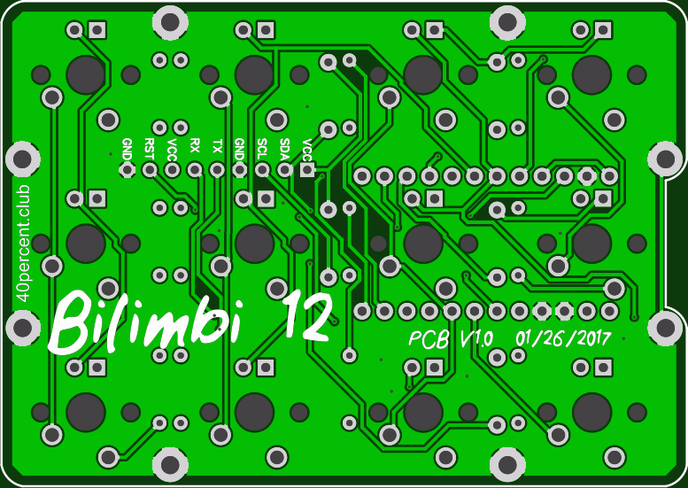
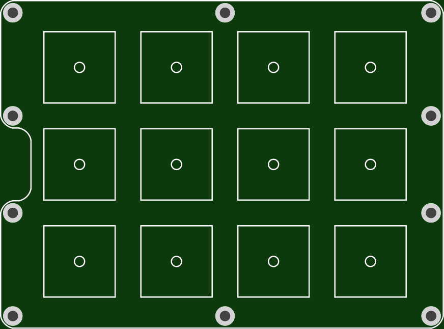
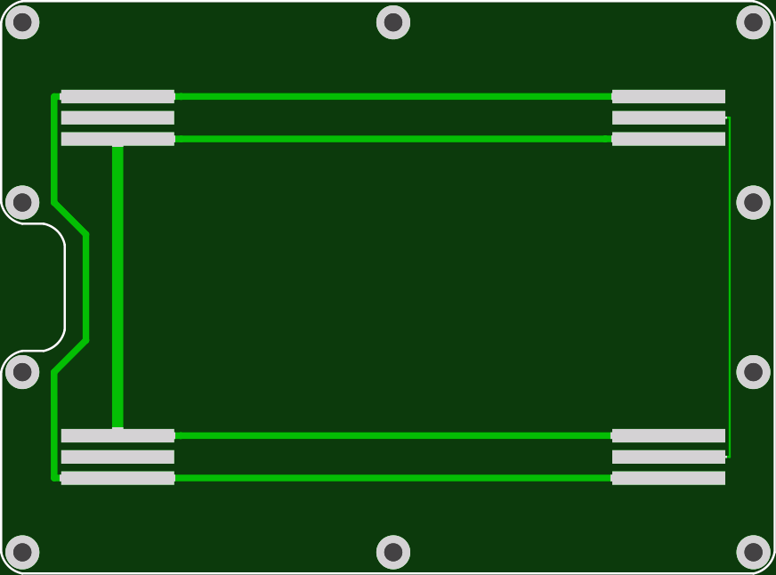

EasyEDA ordering info:

    77.4mm Max* 54.8mm Max;
    Layers: 2;
    PCB Thickness: 1.2mm;
    PCB Qty.: 30;
    PCB Color: Green;
    Surface Finish: HASL;
    Copper Weight: 1;
    Panelized PCBs: 1

Top and bottom plates. Same outer dimensions. Can't guarantee other PCB fabs will do the internal route on the switch holes. 

    86.9mm Max* 64.3mm Max;
    Layers: 2;
    PCB Thickness: 1.6mm;
    PCB Qty.: 20;
    PCB Color: Green;
    Surface Finish: HASL;
    Copper Weight: 1;
    Panelized PCBs: 1

Gerber files released under https://creativecommons.org/licenses/by-sa/4.0/

