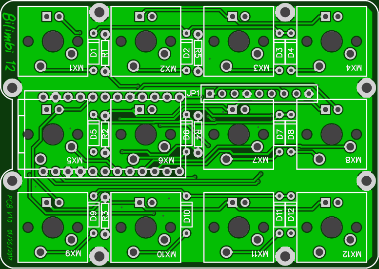

## bilimbi keyboard firmware

======================
bilimbi keyboard. 4x3 matrix.

Key matrix pinout

    col: D4, C6, D7, E6
    row: B4, B5, B6

LED matrix pinout

    col: F4, F5, F6, F7
    row: B1, B2, B3

BOM

    1	Pro Micro (5V, 16MHz)
    2	12pin SIP headers, or 1 24 pin machined pin DIP socket
    12	1n4148 diodes, save the cut off leads for use with machined pin socket
    12	switches

Needed if you want LEDs

    12	LEDs
    3	Resistors for LEDs (R1-R3). Use online LED caculator to choose value. Target 10mA single LED output.

Optional for i2c

    2	4.7k resistors (R4, R5)