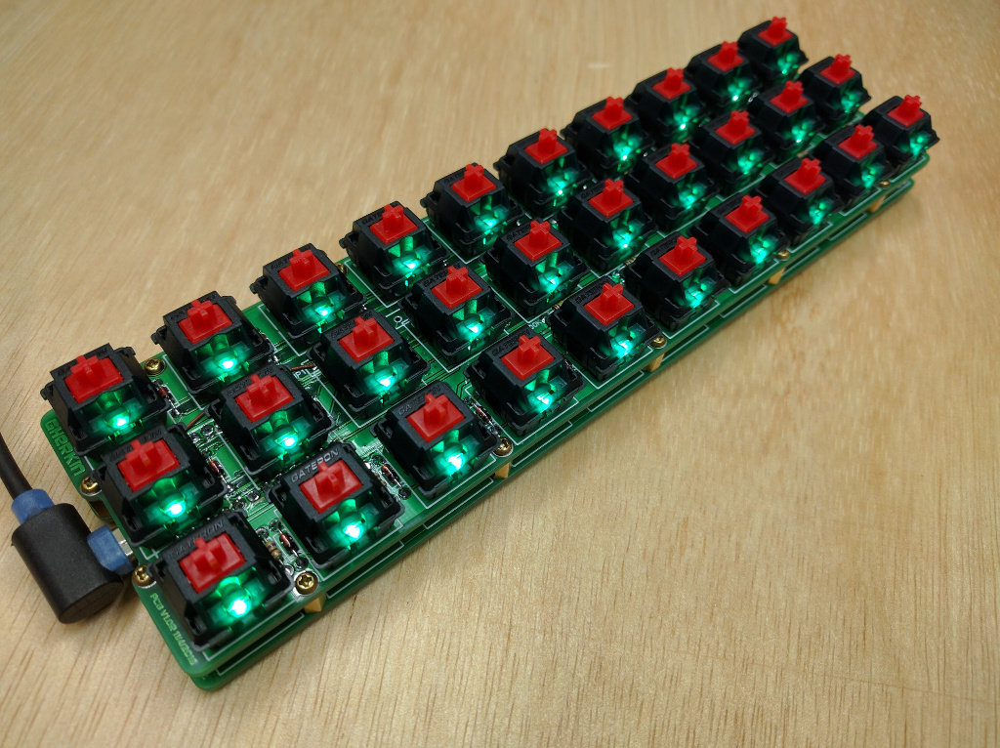
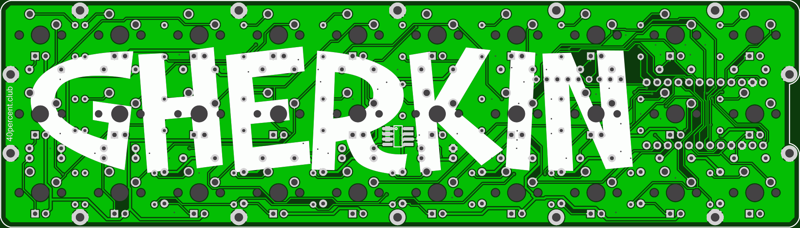

## gherkin keyboard firmware

======================
gherkin keyboard. 6x5 matrix.

Pinout

    col: D0, D4, C6, D7, E6, B4
    row: B6, B2, B3, B1, F7

Mosfet on B5 to control backlight.

BOM

    1	Pro Micro
    2	12pin SIP headers, or 1 24 pin machined pin DIP socket
    30	1n4148 diodes, save the cut off leads for use with machined pin socket
    30	switches

Needed if you want LEDs

    30	LEDs
    30	Resistors for LEDs. Use online LED caculator to choose value
    1	FDS6630A or DMN3018SSS-13 SOIC FET
    1	100ohm resistor
    1	100Kilo ohm resistor

[How to order your own PCBs](http://www.40percent.club/2017/03/ordering-pcb.html)
