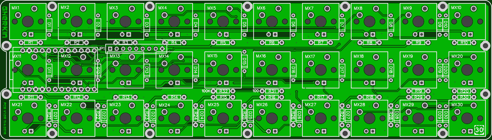

## gherkin keyboard firmware

RGB info here http://www.40percent.club/2016/12/rainbow-pickle.html

======================
gherkin keyboard. 6x5 matrix.

Pinout

    col: D0, D4, C6, D7, E6, B4
    row: B6, B2, B3, B1, F7

Mosfet on B5 to control backlight.

WS2812b data pin on F6.

BOM

    1	Pro Micro
    2	12pin SIP headers
    30	1n4148 diodes
    30	switches

Needed if you want LEDs

    30	LEDs
    30	Resistors for LEDs. Use online LED caculator to choose value
    1	FDS6630A or DMN3018SSS-13 SOIC FET
    1	100ohm resistor
    1	100Kilo ohm resistor
