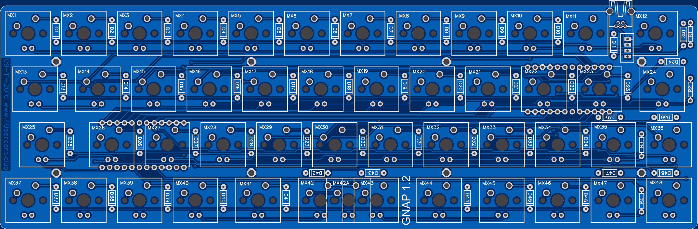
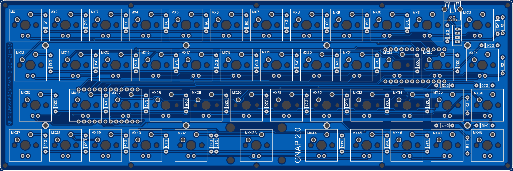

More information in blog:

http://www.40percent.club/search/label/gnap Scroll down and read the older post first.

BOM for PCB

    1	Pro Micro (5v, 16MHz)
    2	12pin SIP headers or a 24 pin socket
    47	1n4148 diodes
    47	switches
    1	mini USB connector Molex part 54819-0519
    1	cut up micro USB cable

Needed in addition if you want LEDs

    1	Pro Micro  (5v, 16MHz)
    2	12pin SIP headers or a 24 pin socket
    47	LEDs
    4	Resistors for LEDs. Use online LED caculator to choose value

Needed for GNAP 2.0

    1	Cherry PCB mount 2U stabilizer

EasyEDA ordering info:

1.2

    238.1mm Max* 76.2mm Max;
    Layers: 2;
    PCB Thickness: 1.6mm;
    PCB Qty.: 5;
    PCB Color: Blue;
    Surface Finish: HASL;
    Copper Weight: 1;
    Panelized PCBs: 1

1.2 Changes

    Added Mini USB connector
    Added mounting holes
    
2.0

    242.9mm Max* 81mm Max;
    Layers: 2;
    PCB Thickness: 1.6mm;
    PCB Qty.: 5;
    PCB Color: Blue;
    Surface Finish: HASL;
    Copper Weight: 1;
    Panelized PCBs: 1

2.0 Changes

    More mouting holes
    PCB mount cherry stabilizer
    Removed split space bar switches

Gerber files released under https://creativecommons.org/licenses/by-sa/4.0/

