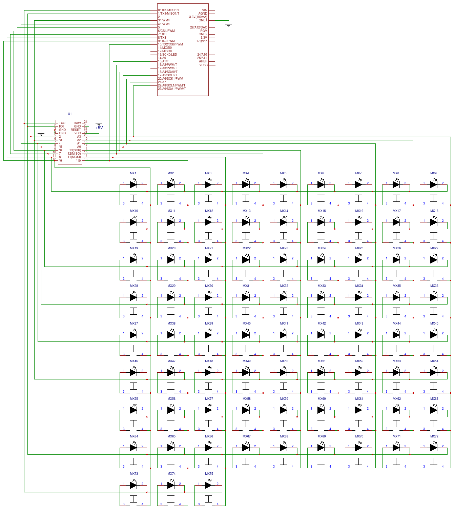

## i75 keyboard firmware

======================
i75 keyboard. 9x9 matrix.

Multiple controller options. Arduino Pro Micro, Teensy 2.0, TeensyLC/3.2

Pinout

	Cols B5  B6  B2  B3  B1  F7  F6  F5  F4
	Rows B4  E6  D7  C6  D4  D0  D1  D2  D3
