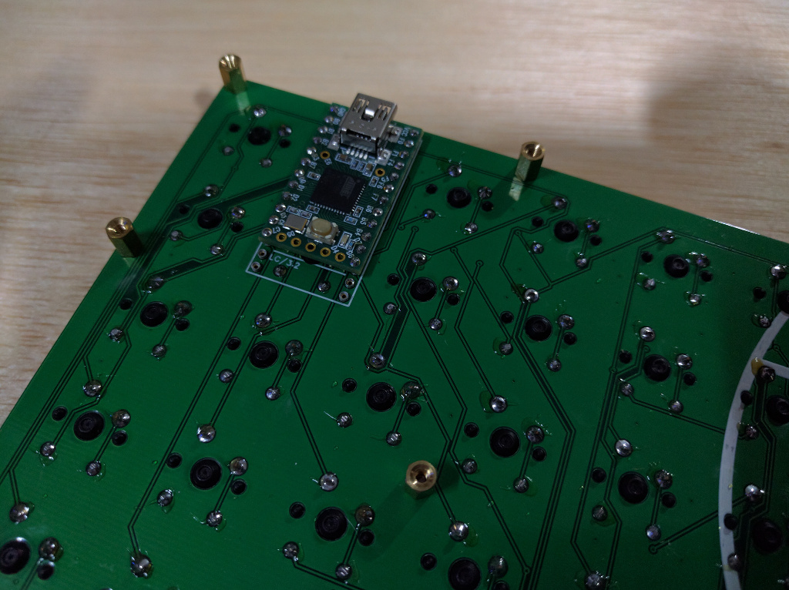

## i75 keyboard firmware

======================
i75 keyboard. 9x9 matrix.

Multiple controller options. Arduino Pro Micro, Teensy 2.0, TeensyLC/3.2

Teensy 2.0 Pinout

	Cols C6  C7  D6  D7  B5  B6  F7  F6  F5
	Rows D3  D2  D1  D0  B7  B3  B2  B1  B0
