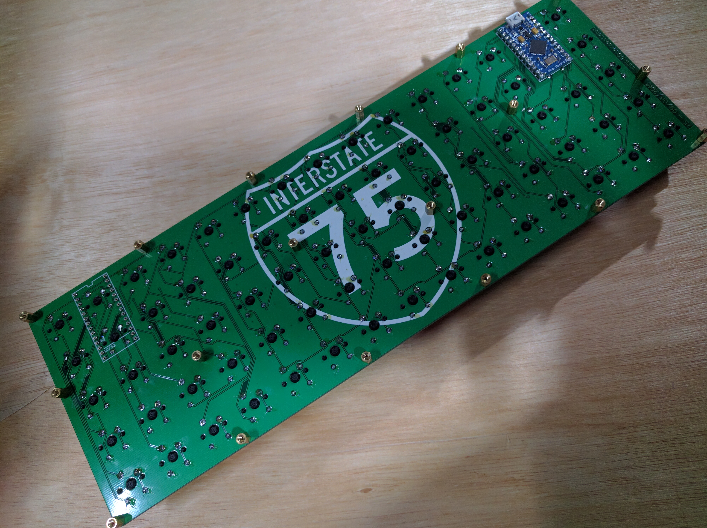
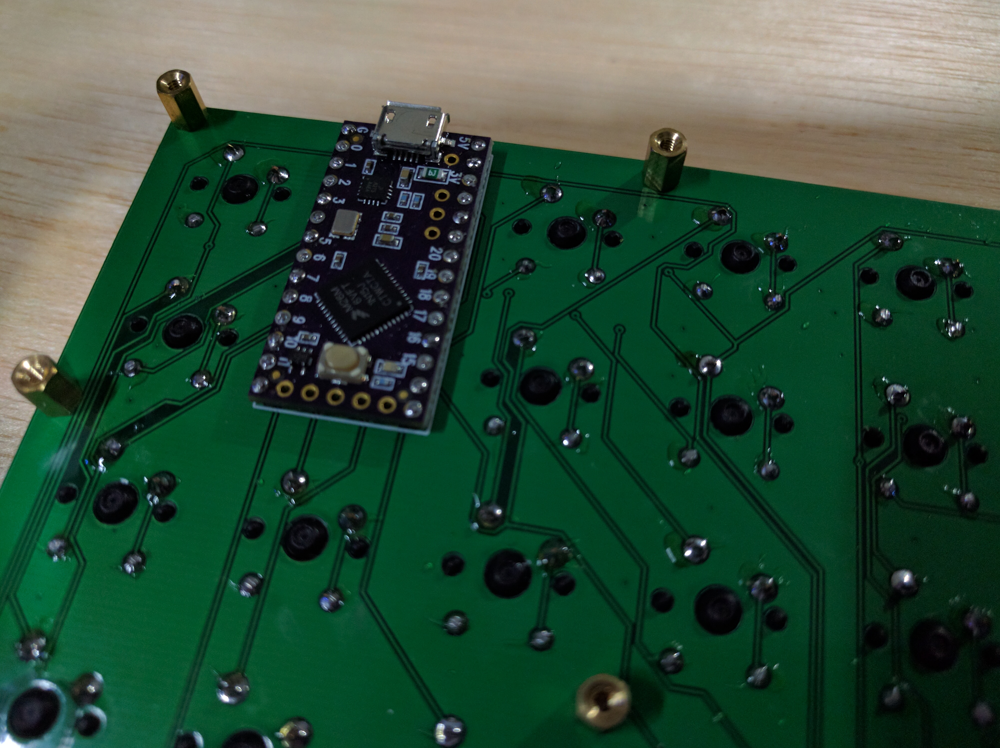
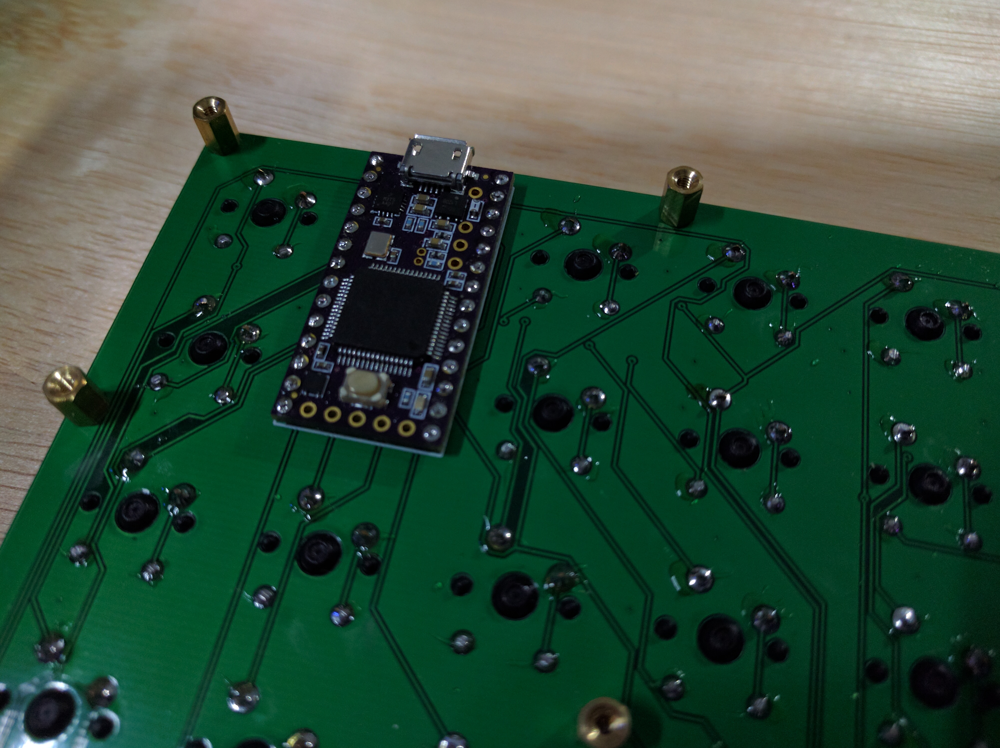
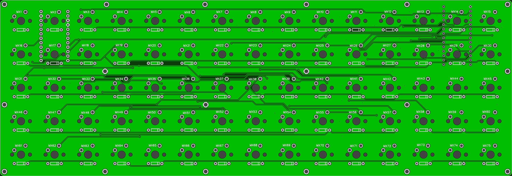

## i75 keyboard firmware

======================
i75 keyboard. 9x9 matrix.

Multiple controller options. Arduino Pro Micro, Teensy 2.0, TeensyLC/3.2

Teensy LC/3.2 Pinout

	Cols 09  10  15  16  18  19  20  21  22
	Rows 08  07  06  05  04  03  02  01  00
