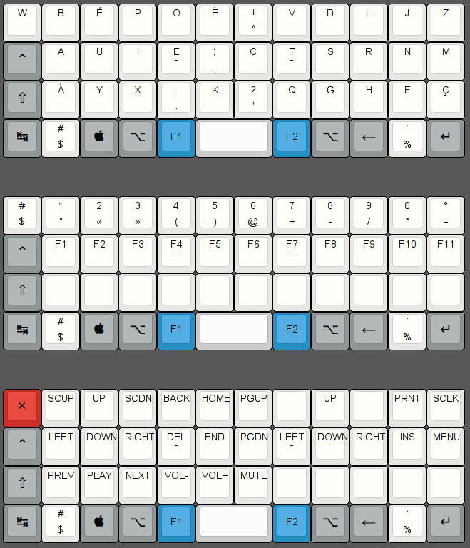

JPEC40 keyboard firmware
========================
DIY compact keyboard designed by Julien Pecqueur using Teensy controller.

The defaut keymap (jpec40) uses the Fn1 key to toggle the alternate layout and the Fn2 key to toggle the function layout.

The space fn keymap (spacefn) uses the Fn1 key to set/unset the alternate layout, the Fn2 key to toggle the alternate layout and the space key to toggle the function layout.

## Build
Move to this directory then just run `make` like:

    $ make

## Keymap
Several version of keymap are available in advance but you are recommended to define your favorite layout yourself. To define your own keymap create file named `keymap_<name>.c` and see keymap document(you can find in top README.md) and existent keymap files.

To build firmware binary hex file with a certain keymap just do `make` with `KEYMAP` option like:

    $ make KEYMAP=[jpec40|spacefn|<name>]

## Load firmware
Move to this directory then just run the teensy-loader-cli tool like this:

    # teensy-loader-cli -mmcu=atmega32u4 jpec40.hex
