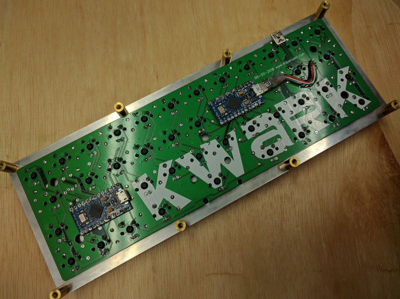

## KWARK keyboard firmware

======================
KWARK dual matrix, dual controller. Per key LED control, reactive lighting.

Based on the GNAP!

Dual Pro Micro's. One running TMK, the other running an Arduino sketch driving the LEDs. Pro Micro's are connected to each other via hardware serial UART.

Pinout

	Rows D1, D0, D4, C6 
	Cols D7, E6, B4, B5, B6, B2, B3, B1, F7, F6, F5, F4
	
keymap_gnap.c contains functions to send bytes to the LED controller. The Arduino code interprets these to change modes or brightness.

	//GNAP keymap functions
	void gnaplight_step(void) {
		serial_send(101);
	}
	
	void gnaplight_toggle(void) {
		serial_send(100);
	}

\tmk_core\common\keyboard.c was modified to send the row/column of the key being pressed encoded as as single byte over the serial link to the LED controller.

	#ifdef GNAP_ENABLE
					//send single byte with value of row column
                    serial_send((r*16)+c);
	#endif

The example Arduino sketch [LED_FastGPIO.ino](LED_FastGPIO.ino) uses the fastGPIO and TimerOne libraries. These can be installed with the Library manager.

[FastGPIO](https://github.com/pololu/fastgpio-arduino)
[TimerOne](https://www.pjrc.com/teensy/td_libs_TimerOne.html)

[Original Quark Keyboard](https://deskthority.net/workshop-f7/quark-keyboard-40-staggered-layout-that-fits-all-planck-cases-t10474.html)