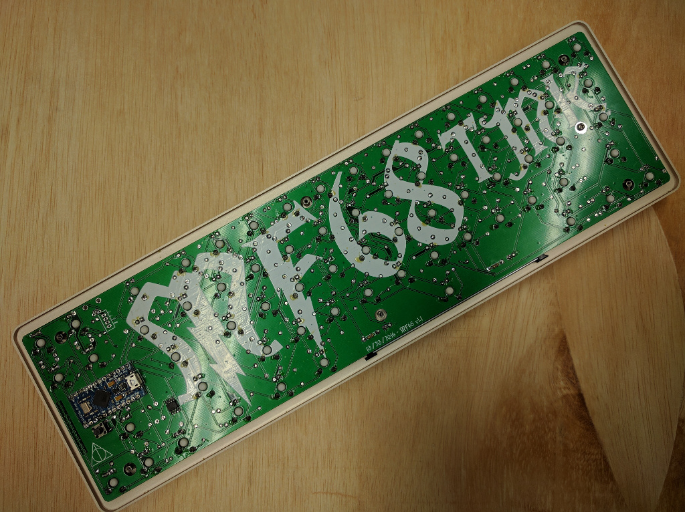
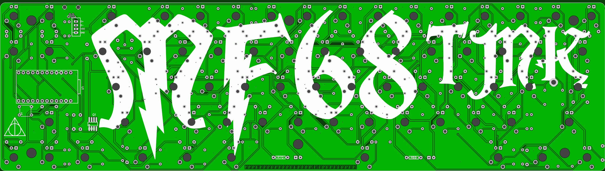

## mf68 keyboard firmware

======================
mf68 keyboard. 9x9 matrix.

Replacement PCB for Magicforce 68. Arduino Pro Micro controller.

Pinout

    col: D3  D2  D1  D0  D4  C6  D7  E6  B4
    row: B6  B2  B3  B1  F7  F6  F5  F4

Mosfet on B5 to control backlight.

6x6mm pushbutton connected between ground and reset pin.

BOM
    1	Pro Micro
    2	12pin SIP headers (usually comes with chinese Pro Micros)
    1	Micro USB cable to cut up to make a pigtail
    68	1n4148 diodes
    1	6x6mm square tactile switch

Needed if you want LEDs
    68-70	LEDs (68 in switches and 2 additional under spacebar)
    68-70	Resistors for LEDs. Use online LED caculator to choose value
    1	FDS6630A SOIC FET
    1	100ohm resistor (R71)
    1	100Kilo ohm resistor (R72)

Recycled from original keyboard
    1	Original Plate/Case
    68	Switches
    1	Set of keycaps
    1	Set of stabilizers
    1	Mini USB cable

If making custom sandwich style case
    mini USB connector
    Molex part 54819-0519